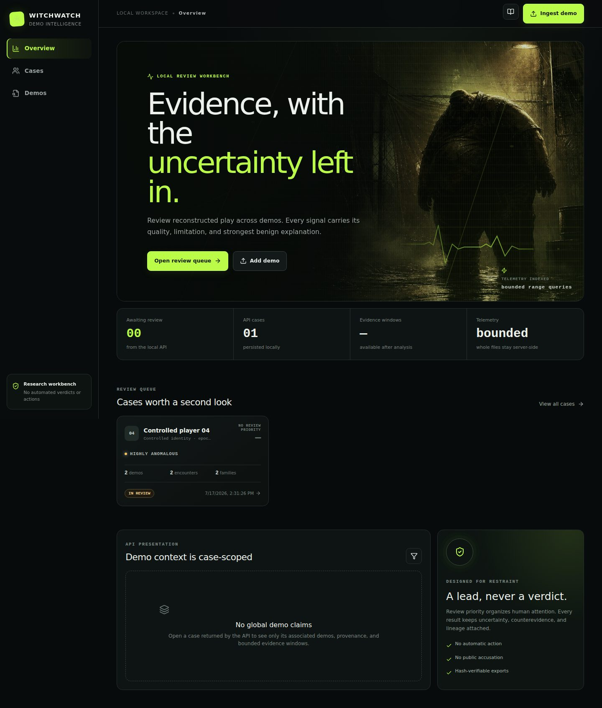

<div align="center">

# WITCHWATCH

### L4D2 demo forensics that shows its work.

**Parse → reconstruct → detect → calibrate → review**

[Architecture](docs/ARCHITECTURE.md) · [Research](docs/RESEARCH.md) · [Plan](PLAN.md) · [Contributing](CONTRIBUTING.md)

</div>

---

WitchWatch is an early-stage, local-first workbench for examining Left 4 Dead 2 demos. It will extract reproducible telemetry, surface anomalous moments, combine evidence across matches, and help a human reviewer reach the exact tick with the reasoning and counterevidence intact.



> [!IMPORTANT]
> A WitchWatch score is a **review priority**, not proof of cheating. Demo telemetry is incomplete, behavior is contextual, and skilled play can look extraordinary. The product will not automate bans or publish accusations.

## The shape of the product

```text
public URL / file
       │  guarded, hashed, immutable
       ▼
 Source 1 decoder ──► canonical observations ──► independent detectors
       │                                                │
       │ protocol quality                               │ evidence + counterevidence
       └──────────────────► calibrated aggregator ◄─────┘
                                      │
                                      ▼
                    timeline · tactical replay · report
```

The first useful interface is not a cinematic renderer. It is a fast evidence timeline and 2D tactical view: player poses, view rays, visibility state, shots, detector features, and a deep link to every tick. Authentic video clips may later be generated by a separate worker controlling a licensed L4D2 installation.

## Engineering choices

| Concern         | Initial choice                               | Why                                                             |
| --------------- | -------------------------------------------- | --------------------------------------------------------------- |
| Workspace       | pnpm + Turborepo                             | Small task graph; low ceremony; polyglot escape hatch           |
| Parser engine   | Narrow dependency-free L4D2 Source 1 decoder | Real fixtures rejected CS:GO/Portal-oriented parser assumptions |
| Contracts       | Versioned TypeScript/JSON schemas            | Stable boundary between parser, jobs, API, and UI               |
| Metadata        | SQLite                                       | One-process, local-first development                            |
| Large artifacts | SHA-256 content-addressed files              | Immutable provenance without database blobs                     |
| UI              | React + Vite + Tailwind                      | Lightweight, typed, quick to iterate                            |
| Scoring         | Interpretable, calibrated model              | Auditable contributions and measurable error                    |

The parser choice was deliberately conditional. The current corpus is homogeneous SourceTV protocol 2100, so protocol and capture-type limitations remain explicit. The narrow decoder now reconstructs real entity telemetry across all ten demos; independent parser/playback comparison remains a pre-release validation task rather than a blocker for calibration development.

## Repository

```text
apps/web/             evidence-workbench shell
apps/api/             bounded local HTTP/SSE review API
apps/worker/          single-process, retryable engine jobs
apps/cli/             deterministic demo/corpus inspection
packages/acquisition/ guarded discovery, download, and ZIP handling
packages/contracts/   canonical cross-boundary types
packages/demo-source1 bounded Source 1 outer framing
packages/detectors/   explainable evidence windows and encounters
packages/l4d2-schema/ explicit-availability projection primitives
packages/scoring/     capped aggregation, calibration, and policy
packages/storage/     SQLite metadata + content-addressed artifacts
docs/                 architecture, research, decisions, safety
PLAN.md               five executable sprint workflows
AGENTS.md              rules for coding agents
CLAUDE.md              concise Claude entrypoint
```

The API, worker, and storage boundary remains deliberately local and lightweight:
Node's built-in SQLite binding, a single polling worker, and bounded browser payloads.

## Start locally

### Docker — recommended

Docker Desktop is the only host requirement. Dependencies, Node 24, pnpm, .NET 7, and Linux-native modules stay in named Docker volumes:

```bash
docker compose up --build
# or, if pnpm is already available on the host:
pnpm dev:docker
```

Open `http://localhost:5173`. Compose starts the web app, API, and local worker with
a durable named SQLite volume. Demos under `data/sprint-1-corpus/extracted` are
mounted read-only at `/data/inbox`; the ingest dialog accepts that container path
or an allowlisted HTTPS URL. Source files are bind-mounted for hot reload, while
every workspace `node_modules` directory remains container-owned. Stop with
`Ctrl+C`; remove the Compose containers with `docker compose down` or
`pnpm dev:docker:down`. See the [local workbench operations guide](docs/operations/local-workbench.md).

To run the independent UntitledParser framing check inside the same image after placing demos under `data/sprint-1-corpus/extracted`:

```bash
docker compose --profile tools run --rm reference
# or: pnpm reference:untitled:docker
```

Outputs stay ignored under `data/reference-validation/`.

### Native

Requirements: Node 24+ and Corepack.

```bash
./init.sh
pnpm dev
```

`pnpm dev` starts only the long-running web application; use Docker for the complete
API/worker workflow. The CLI is intentionally one-shot. Run CLI commands with
`pnpm dev:cli -- <command>` or `pnpm --filter @witchwatch/cli dev <command>`.
`init.sh` installs container system prerequisites, Node 24, the pinned pnpm release,
Chromium for Playwright, the frozen workspace, and runs every quality check. Set
`SKIP_CHECKS=1` for dependency-only setup or `SKIP_SYSTEM_DEPS=1` when the image
already has native tools. Raw demos, archives, databases, reports, and browser test
artifacts are ignored by Git.

Reproduce the controlled-fixture calibration and immutable Sprint 3 bundle with:

```bash
pnpm scoring:evaluate
```

This validates the engineering machinery, not population performance. Its numeric
output is a research-only review priority and every artifact carries
`reference-validation-pending`.

## Quality bar

- Deterministic output for the same demo hash, engine version, assets, and config.
- Every finding preserves tick range, context, feature values, version, quality, limitations, and counterevidence.
- Parser golden fixtures, corruption/fuzz tests, detector geometry tests, player-level evaluation, and end-to-end review tests.
- No probability before adequate independent evidence; no random-tick train/test leakage.
- Every externally sourced artifact has provenance and retention policy.
- Unknown protocol fields degrade visibly; they do not silently become zeros.

## Status

**Sprint 4 is complete and independently audited.** The local workbench provides
guarded local/allowlisted ingest, real evidence generation, privacy-stable cross-demo
association, durable review, strictly bounded telemetry, and SHA-256-verifiable reports.
Original cinematic key art and reduced-motion animation create a directly L4D2-inspired
visual language without copying game assets. Reproduce the evidence from the
[Sprint 4 report](docs/sprints/sprint-4-execution.md) and
[storage decision](docs/decisions/0006-local-workbench-storage.md).

The displayed example case is an invented controlled UI fixture. It demonstrates
the workflow, not real-player accuracy or a cheating probability. Real-world
decision support remains blocked on the validation described in Sprint 5.

## Name and license

“WitchWatch” is a working project name, not a claim about any player. No software license has been selected yet; the repository is not offered for redistribution until one is added. Third-party parser code must remain isolated and license-reviewed.
