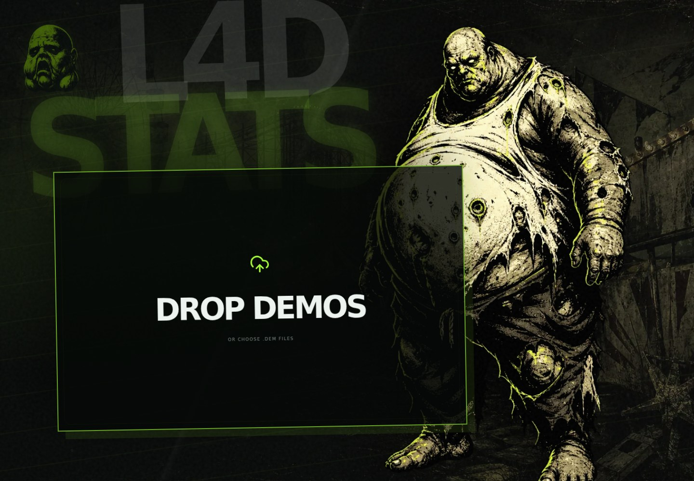

<div align="center">

# L4DStats

### Drop demos. Get the whole match.

A local-first Left 4 Dead 2 demo deep dive.

[Run it](#run-it) · [L4D2 & Versus reference](L4D2.md) · [Demo data contract](DEMO-DATA.md) · [Rating methodology](docs/L4DSTATS-RATING.md) · [Architecture](docs/ARCHITECTURE.md) · [Plan](PLAN.md)

Production operators should also keep the
[monitoring and incident-response runbook](docs/operations/production-response.md)
with the deployment.

The proposed independently scalable Cloudflare/Turso deployment and the manual
provider setup it requires are tracked in the
[hosted operations runbook](docs/operations/hosted-cloudflare-turso.md). It is
not yet a replacement for the production Compose path.

</div>



L4DStats turns up to ten SourceTV `.dem` files into a fast, privacy-conscious match report. The hosted app also accepts one demo per `.dem.zip`, `.dem.gz`, `.dem.xz`, `.dem.bz2`, or `.dem.zst` file through a bounded, fail-closed expansion boundary. Demos are streamed, hashed, queued, and analyzed in parallel.

The result is statistics first. Detector output is deliberately secondary and is always presented as a review signal - not a cheating verdict.

## What it extracts

- Match duration, playback ticks, effective tick rate, map, file size, and SHA-256 provenance
- Player names, Steam profile identities, epoch-safe joins, team/class, tracked duration, and sample count
- Movement distance, view-angle travel, observed position/angle coverage, and weapon usage
- Total decoded events plus supported event-family counts
- Field-by-field reconstruction availability and parser issue counts
- Interesting detector windows with exact ticks, explanation, counterevidence, and quality
- Filename-independent game reconstruction from embedded server continuity,
  stable roster, campaign, and chapter evidence
- Game-wide totals with per-map inclusion toggles across every statistics tab
- Persistent `/game/:id/:tab` links for sharing a complete game, plus legacy
  `/analysis/:id/:tab` links for an individual demo
- Versus campaign/chapter score, half/team-flip context, Survivor/SI deaths, and Tank/Witch outcomes
- Eight-player Survivor/Infected scoreboard with CI/SI kills, incaps, revives, pins, class/weapon attribution, and checkpoint counters
- Filterable tick-addressed story for SI spawns, pins, incaps, revives, team swaps, round boundaries, and deaths
- One-click reanalysis of older stored artifacts with the current engine

## Run it

Docker Desktop is the only host dependency:

```bash
docker compose up --build
# equivalent: pnpm dev:docker
```

Open [http://localhost:5173](http://localhost:5173), then drop up to ten `.dem` files onto the page. From another device on your LAN or Twingate network, open `http://<your-mac-ip>:5173`. The web and API ports are explicitly published on `0.0.0.0`, so they accept traffic arriving through either interface. Your macOS firewall and Twingate resource policy must allow TCP port 5173.

Before sharing the web port, enable its single-user access gate and replace the
development API secret:

```bash
export L4DSTATS_WEB_USERNAME=l4dstats
export L4DSTATS_WEB_PASSWORD='use-a-long-random-password'
export L4DSTATS_API_TOKEN="$(openssl rand -hex 32)"
pnpm dev:docker
```

Use the web gate only through Twingate or TLS. It protects a private single-user
workbench. The compiled production server also supports a secret-managed
`L4DSTATS_WEB_USERS_JSON` array with `viewer`, `reviewer`, and `admin` roles;
see [local operations](docs/operations/local-workbench.md).

For the compiled application and the hardened static/proxy server, use the
production Compose overlay. It refuses to start without the web credentials and
API token above:

```bash
pnpm prod:docker
pnpm health:production
pnpm metrics:production
pnpm prod:docker:down
```

The readiness probe checks the public web, API and SQLite path. The metrics
probe additionally verifies worker-heartbeat freshness and queue age. Both use
the production web credentials and are intended to run through the same private
network path as operators.

`pnpm test:production` also renders and validates the production Compose model.
It requires Docker Compose, but does not require a running Docker daemon for
that configuration gate.

The web app, API, worker, SQLite database, upload storage, and native dependencies all run inside Compose. Source files are bind-mounted for hot reload; dependencies and application data stay in named Docker volumes.

Stop with `Ctrl+C`. Remove the containers with:

```bash
pnpm dev:docker:down
```

For native development with Node 24+ and Corepack:

```bash
./init.sh
pnpm build
pnpm dev
```

Native `pnpm dev` starts the web surface only; use Compose for the complete analysis pipeline.
The normal evidence path requires the repository-built Rust Node-API addon at
`crates/demo-source1-node/dist/demo-source1-node.node`. A fresh development
Compose worker prepares that addon with `pnpm native:prepare`; local CLI and web
development commands use the same prerequisite. Production images build and
verify a provenance-stamped addon themselves. The Rust parser is the only demo
parser implementation; an
addon load or compatibility failure stops analysis rather than selecting another
parser.

`pnpm dev:docker` force-recreates the three application containers so the web
proxy and API cannot retain different authentication environments. Named
volumes are preserved, so this does not delete existing analyses or downloaded
dependencies.

### Optional official-map geometry

The repository includes provenance-stamped analytical meshes for The Parish
(`c5m1`-`c5m5`). `pnpm dev:docker` uses locally extracted geometry first and
falls back to the committed subset automatically, so Parish reports render real
static BSP-derived geometry on a fresh checkout.

To build the complete 57-map local cache, install the L4D2 dedicated-server
depot into a Docker volume and extract the analytical meshes:

```bash
pnpm maps:install
pnpm maps:extract
```

To copy the validated complete cache out of Docker's named volume and into the
checkout, run:

```bash
pnpm maps:export
```

The export is idempotent. It refuses to copy a partial cache and requires 57
official map meshes plus `catalog.json` before writing `map-geometry/`.

On a fresh x86-64 Ubuntu host, the idempotent setup script installs Docker from
Docker's official apt repository, validates available storage, and runs both
steps:

```bash
sudo ./scripts/setup-maps-ubuntu.sh
```

It is safe to rerun. It preserves the named source-assets and workbench-data
volumes and never invokes volume cleanup. The source BSPs remain local to that
Ubuntu installation. A complete local cache takes precedence over the committed
Parish subset.

This is a substantial optional Steam download. The generated BSPs and geometry
cache remain inside local named volumes. Extraction writes one analytical mesh
for all 57 official campaign chapters plus a local `catalog.json`. The
installation resolver follows Source search precedence across `update`, DLC3,
DLC2, DLC1, and the base game, and fails if any official chapter is missing.
The catalog records the selected content root, BSP hash, Steam build ID when
SteamCMD exposes it, extractor version, triangle count, and map revision. Audit
an existing cache against its source installation with
`pnpm --filter @l4dstats/map-source1 validate-installation
path/to/l4d2 path/to/geometry`. Restart is unnecessary because the API reads
the cache on demand. Custom maps can use
the same extractor with `pnpm --filter @l4dstats/map-source1 extract
path/to/map.bsp path/to/geometry/map.json`. See
[ADR 0007](docs/decisions/0007-local-map-geometry-assets.md) for coverage,
licensing, and correctness boundaries.

To verify that parsed demo player coordinates share the extracted BSP world
coordinate system, run `pnpm --filter @l4dstats/map-source1
validate-demo-alignment path/to/geometry path/to/demo.dem [...]`. The command
reports observed counts, in-bounds counts and observed coordinate bounds, and
fails rather than inventing a rate when position telemetry is unavailable.

## Architecture

```text
browser .dem files
       │ streamed + SHA-256 hashed
       ▼
local API ──► durable SQLite job queue ──► worker
                                              │
                   native Rust decode ──► L4D2 observation projection
                                              │
                   descriptive stats ◄── events + player telemetry
                                              │
                   review signals ◄──── explainable detectors
                                              │
       browser results ◄──── versioned analysis artifact
```

The monorepo uses pnpm and Turborepo. The engine is deliberately narrow and dependency-light; unknown protocol data remains explicitly unavailable rather than silently becoming zero.

```text
apps/web/             React/Vite upload, progress, and results experience
apps/api/             streaming uploads, job state, and bounded local API
apps/worker/          retryable analysis jobs and artifact persistence
apps/cli/             deterministic demo/corpus inspection
packages/contracts/   parser-neutral observation and projection contracts
crates/demo-source1-native clean-room bounded Rust decoder and projection
crates/demo-source1-node coarse bytes-only Node-API binding
packages/detectors/   explainable, prerequisite-gated review signals
packages/storage/     SQLite jobs and content-addressed artifacts
```

## Quality and safety

```bash
pnpm check
pnpm test
pnpm build
pnpm --filter @l4dstats/web test:e2e
pnpm --filter @l4dstats/web test:e2e:real
pnpm test:production
pnpm test:recovery
pnpm test:sandbox
pnpm security:check
```

When the ignored fresh corpus is present, the real-boundary browser test uploads
the three-map CEDAPug game `916532` through the browser → API → worker → parser
→ SQLite path used by the product. It checks grouped identities, v6 HP bounds
and every result tab at a phone viewport. Production assets have an enforced
first-load budget. The recovery gate verifies checksum rejection, archive
safety, SQLite reopening and exact artifact hashes after restoration.
On Linux, the sandbox gate runs a complete real CEDAPug evidence bundle through
the production seccomp and Node-permission boundary.

Native performance regressions use `tools/demo-benchmark/benchmark.mjs` with
explicit ignored demo paths. The harness hashes fixtures instead of retaining
their contents, enforces release artifacts, runs demos sequentially, performs
warmups and records repeated wall, CPU, maximum-RSS and throughput
distributions plus command, artifact, toolchain and host provenance. Optional
same-host median wall/RSS/throughput thresholds can fail
a regression run. Stage and end-to-end addon measurements remain separate. The
historical comparison recorded on the Linux arm64 benchmark host found that the
five-demo end-to-end median fell from 138.985 seconds for the optimized
now-removed TypeScript implementation to 53.816 seconds for native Rust
(2.583x); median peak RSS
fell from 1,988,496 KiB to 1,290,136 KiB. This is 9.36x faster than the original
503.57-second baseline. These TypeScript figures are historical migration
evidence, not a selectable benchmark target. Demos and identity-bearing outputs
must never be committed.

> [!IMPORTANT]
> L4DStats output is descriptive. Demo telemetry is incomplete, behavior is contextual, and skilled play can look extraordinary. Signals do not prove player conduct and must not be used for automated enforcement.

## Project status

The upload, parallel job processing, descriptive statistics, player/event/quality views, secondary signal review, Docker workflow, and real-corpus boundary are implemented. Parser and detector validation work continues under [PLAN.md](PLAN.md); see [RESEARCH.md](docs/RESEARCH.md) for the evidence limits.

No software license has been selected. The repository is not offered for redistribution until one is added. Third-party parser code and reference assets must remain isolated and license-reviewed.
